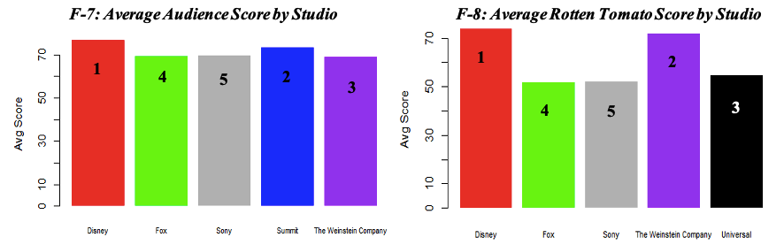

# Hollywood_Movie_Rating_Analytics

## 1. Introduction

Movies play a major role in the entertainment industry. People love to be entertained especially through watching movies. Indeed, they do not want to spend their valuable time and money to watch something boring. Hence it is useful to know the following questions before watching any movie.
### Research Questions 
* What factors should be observed to select a movie?
* Whether an audience should rely on critic score?
* Does a box office hit movie mean higher ratings?

The data set titled “Hollywood’s most profitable stories” sheds some light on answering the above questions. The dataset contains information about Hollywood’s 74 most profitable stories released from the year 2007 to 2011. Out of 74 movies, five movies are removed from analysis due to missing information. Overall, the entire dataset is quite clean and no major data tidiness issues.

## 2. Movies at Glance

### 2.1 Genre
#### Average Audience and Rotten Tomato (Critic) Scores by Genre

* When comparing all the genres, Fantasy and Animation seem the best performing as the average audience and critics score is the highest for Fantasy: (81, 73) and Animation: (76, 80) respectively (F1-2). 
#### Average Worldwide Gross by Genre

* Animation is performing slightly better than Fantasy in the average worldwide gross. 

### 2.2 Studio
#### Average Audience and Rotten Tomato (Critic) Scores by Studio

#### Average Worldwide Gross by Studio

* A combined look at genre and studio graphs, it can be said that Disney is responsible for the Animation genre performing well. The only three animation movies are produced by Disney. It produced the least number of movies and earned the second highest amount of total worldwide gross. 

### 2.3 Year
#### Average Audience and Rotten Tomato (Critic) Scores by Year

#### Average Worldwide Gross by Year

* The above graph explains that the 2008 has the greatest number of movies and total worldwide gross income is the also highest. 
* We can observe a pattern that if the number of films made in the year is more, then the worldwide gross income is also high for that year. 

## 3. Analysis of Movie Ratings
### 3.1 Summary Statistics 

* The mean score of the audience score is 64.46 and Rotten Tomato score is 47.88. 
* Based on the 1st quartile and 2nd quartile values we observed that half of the score of Audience Score lies between 53 to 65 however the Rotten Tomato Score lies between 27 to 46, this shows that Audience give the score to movie more liberally then Rotten Tomato critics. 
* Most of the movies worldwide gross income lies between $32.59 to $79.18 million. There is a block buster movie $709.8 millions of worldwide gross.

### 3.2 Correlation Coefficient 

* The correlation coefficient is 0.57. This suggests a moderate positive relationship between the audience and rotten tomato scores. 

### 3.3 Analysis of Vairance and Mean Difference of Ratings

#### Analysis of Variance
* The audience score varies less than rotten tomato score as evident by the standard deviation above. 
* The F-test is conducted to confirm that claim. The p-value here is less than 5%; therefore, it confirms that the variation in the two scores is different. 
* The higher variation in the Rotten Tomato score suggests that the critics are tough graders and compared to the audience.  
#### Mean Difference Between Ratings 
* Based on the p-value which is less than 5%, we can conclude that the population mean for audience scores are different from the population mean for tomato scores. 
* This may be observed with the average difference between the movie ratings of 16.58. For example, an audience may rate a movie at 66.58 while the critic may rate it at 50.  
* With the 95% confidence, we can estimate the difference interval for these two population means to be between 11.47 and 21.69. 

### 3.4 Linear Regression for Ratings and Worldwide Gross

* We can compute the coefficient of determination r^2 =0.1568551, now we can conclude, there are about 15% of the variability in Worldwide gross can be explained by the linear relationship between Audience score and Worldwide gross. So, our regression equation is not so good.
* We can compute the coefficient of determination r^2 =7.379579e-05. So, this time we obtain a worse model, then we would not use it to make any prediction.
* Since there is no linear relationship between rotten tomato score and worldwide gross, we will not suggest anything this time. 
* It’s up to you if you would like to refer to worldwide gross when a film has a high rotten tomato score.

## 4.Recommendation 
### 1.)	What movie to watch from the dataset? 
* We will recommend Watching Wall-E or Tangled: Audience Rating: 90/100 (Grossed over $350 mil). 

### 2.)	Audience is a decent indicator to select a film
* Based on our analysis we can say that the Audience Score is relatively better indicator. 
* However, Critic score & Worldwide gross are may not be the best estimate to choose a film. 
* The audience watching a film may not have the same standards as the critics; hence; a lower critic score does not mean audience will dislike it. 
